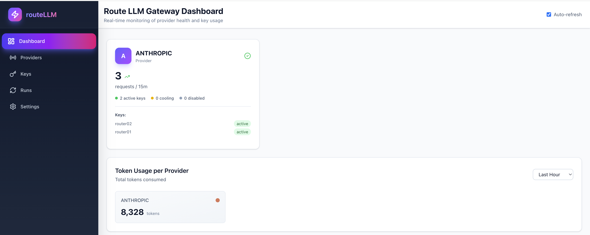
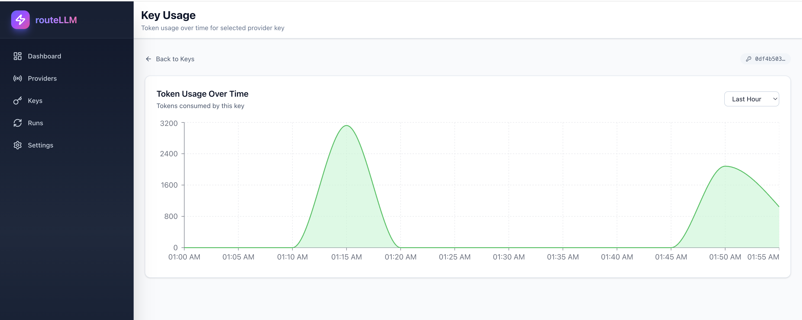

# Route LLM Gateway

A high-performance gateway for routing and managing LLM (Large Language Model) requests with intelligent load balancing, provider key management, async job processing, and comprehensive monitoring capabilities.



## Features

- 🚀 **Multi-Provider Support**: OpenAI, Anthropic, DeepSeek, Gemini
- 🔑 **Intelligent Key Management**: Database-backed key pool with automatic failover, rate limiting, and cooling periods
- ⚡ **Async Agent Runs**: Background job processing with Redis Queue
- 📊 **Real-Time Dashboard**: Comprehensive monitoring with provider health, token usage, and key statistics
- 📈 **Token Usage Tracking**: Time-based analytics (hour, day, week, month) with Redis-backed timeseries data
- 🎯 **Idempotency**: Prevent duplicate requests with idempotency keys
- 🔐 **Authentication**: JWT-based authentication for secure API access
- 📎 **Multimodal Support**: Handle image attachments for vision-capable models
- 📁 **File Management**: Upload, store, and manage files for LLM requests
- 🐳 **Docker Ready**: Full docker-compose setup for development
- ☸️ **Kubernetes Ready**: Helm chart for production deployment

## Screenshots

### Dashboard Overview
The dashboard provides real-time monitoring of provider health, token usage, and key status.


### Key Usage Analytics
Detailed token usage analytics with time-based filtering for individual provider keys.



## Quick Start

### Option A: Docker Compose (Development)

1. **Clone and setup:**
   ```bash
   git clone <repository-url>
   cd route-llm-gateway
   cp .env.backend.example .env.backend
   # Edit .env.backend with your API keys
   ```

2. **Start services:**
   ```bash
   docker compose -f docker-compose.dev.yml up --build
   ```

3. **Access:**
   - Frontend Dashboard: http://localhost
   - Backend API: http://localhost:8000
   - API Docs: http://localhost:8000/docs
   - Prometheus: http://localhost:9090

4. **Default Login:**
   - Email: `admin@example.com`
   - Password: `Admin123!` (change on first login)

📖 **Detailed guide**: [Docker Compose Deployment](docs/deploy-docker-compose.md)

### Option B: Helm (Kubernetes)

1. **Build and push images:**
   ```bash
   docker build -f deploy/docker/backend.Dockerfile -t your-registry/route-llm-gateway-backend:0.5.0 .
   docker build -f deploy/docker/frontend.Dockerfile -t your-registry/route-llm-gateway-frontend:0.5.0 .
   docker push your-registry/route-llm-gateway-backend:0.5.0
   docker push your-registry/route-llm-gateway-frontend:0.5.0
   ```

2. **Install with Helm:**
   ```bash
   helm install route-llm-gateway ./deploy/helm/route-llm-gateway \
     --values deploy/helm/route-llm-gateway/values.yaml \
     --namespace route-llm-gateway \
     --create-namespace
   ```

📖 **Detailed guide**: [Helm Deployment](docs/deploy-helm.md)

## High-Level Architecture

The Route LLM Gateway consists of:

- **Backend**: Python 3.11+ with FastAPI + Uvicorn - handles API requests, routing logic, and business logic
- **Frontend**: React + Vite + TypeScript - provides a modern dashboard for monitoring and configuration
- **Worker**: RQ worker for processing async agent runs
- **PostgreSQL**: Primary database for storing provider keys, runs, and configuration
- **Redis**: Job queue for async processing and token usage timeseries storage
- **Prometheus**: Metrics collection and monitoring

### Data Flow

```
┌─────────────┐
│   Client    │
└──────┬──────┘
       │
       ├─── POST /v1/llm/chat
       │    └─── Backend selects best key
       │         └─── Provider API (OpenAI/Anthropic/etc)
       │
       ├─── GET /v1/stats/providers
       │    └─── Dashboard displays real-time stats
       │
       └─── POST /v1/agent/runs
            └─── Worker processes async
                 └─── Redis Queue
```

## Dashboard Features

### Provider Health Monitoring
- Real-time provider status (active, cooling, disabled)
- Request counts and error rates
- Active key statistics per provider
- Auto-refresh capability

### Token Usage Analytics
- Time-based filtering: Hour, Day, Week, Month
- Per-provider token consumption
- Historical usage trends
- Redis-backed timeseries storage

### Key Management
- View all provider keys with status
- Detailed key usage analytics
- Token usage charts with time filtering
- Key health monitoring

## API Endpoints

### Authentication
- `POST /v1/auth/login` - Login and get JWT token
- `POST /v1/auth/change-password` - Change user password

### Health & Status
- `GET /health` - Health check
- `GET /metrics` - Prometheus metrics
- `GET /v1/stats/providers` - Provider statistics
- `GET /v1/stats/providers/tokens?period={hour|day|week|month}` - Token usage per provider
- `GET /v1/stats/keys` - Key statistics
- `GET /v1/stats/debug/key/{key_id}` - Detailed key debug info

### LLM Chat
- `POST /v1/llm/chat` - Synchronous chat completion
  - Supports text and image attachments
  - Automatic provider selection
  - Token usage tracking

### Async Agent Runs
- `POST /v1/agent/runs` - Create async run
- `GET /v1/agent/runs/{id}` - Get run status
- `POST /v1/agent/runs/{id}/cancel` - Cancel run

### Provider Keys Management
- `GET /v1/admin/keys` - List provider keys
- `POST /v1/admin/keys` - Create provider key
- `PATCH /v1/admin/keys/{id}` - Update provider key
- `DELETE /v1/admin/keys/{id}` - Delete provider key

### File Management
- `POST /v1/files` - Upload files (requires authentication)
- `GET /v1/files/{file_id}` - Get file (requires authentication)
- `DELETE /v1/files/{file_id}` - Delete single file
- `DELETE /v1/files?file_ids=id1&file_ids=id2...` - Batch delete files

### Key Usage Analytics
- `GET /v1/stats/keys/{key_id}/timeseries?window_minutes={n}&step_seconds={n}` - Get token usage timeseries for a key

## Key Selection Logic

The gateway uses intelligent key selection with the following priorities:

1. **Active Keys Only**: Only keys with `active` status are considered
2. **Rate Limiting**: Keys that have exceeded their RPM (requests per minute) limit are excluded
3. **Cooling Period**: Keys in cooling period (after errors) are excluded
4. **Round-Robin**: Among eligible keys, selection is done in round-robin fashion for load distribution
5. **Error Handling**: Keys that fail are automatically put into cooling period

## Token Usage Tracking

Token usage is tracked in Redis for:
- **Persistence**: Data survives container restarts
- **Shared Access**: Both backend and worker can record usage
- **Timeseries**: Bucketed data for efficient querying
- **Time Windows**: Support for hour, day, week, and month views

Data is automatically evicted after 24 hours to manage memory usage.

## Documentation

- [Docker Compose Deployment Guide](docs/deploy-docker-compose.md) - Run locally with Docker
- [Helm Deployment Guide](docs/deploy-helm.md) - Deploy on Kubernetes
- [Architecture Overview](docs/architecture.md) - System architecture details

## Project Status

### Completed Phases ✅

- **Phase 0**: Project bootstrap, Docker setup
- **Phase 1**: Core LLM routing with provider abstraction
- **Phase 2**: Provider key pool management with PostgreSQL
- **Phase 3**: Prometheus metrics and stats dashboard
- **Phase 4**: Async agent runs with Redis Queue and idempotency
- **Phase 5**: Production-ready deployment (Helm charts, polished Dockerfiles)
- **Phase 6**: Real-time dashboard with provider health monitoring
- **Phase 7**: Token usage tracking with Redis timeseries
- **Phase 8**: Authentication and file management
- **Phase 9**: Multimodal support (image attachments)

### Future Phases

- **Phase 10**: Advanced caching and rate limiting
- **Phase 11**: Cost tracking and analytics
- **Phase 12**: Multi-tenant support
- **Phase 13**: Webhook notifications
- **Phase 14**: Advanced analytics and reporting

## Development

### Prerequisites
- Docker and Docker Compose
- Node.js 18+ (for local frontend development)
- Python 3.11+ (for local backend development)

### Running Tests
```bash
# Backend tests
cd backend
pytest

# Frontend tests (when implemented)
cd frontend
npm test
```

### Code Structure
```
route-llm-gateway/
├── backend/              # FastAPI backend
│   ├── app/
│   │   ├── api/         # API endpoints
│   │   ├── providers/   # LLM provider implementations
│   │   └── ...
│   └── requirements.txt
├── frontend/            # React frontend
│   ├── src/
│   │   ├── pages/      # Page components
│   │   ├── components/ # Reusable components
│   │   └── ...
│   └── package.json
├── deploy/              # Deployment configs
│   ├── docker/         # Dockerfiles
│   └── helm/          # Helm charts
└── docs/               # Documentation
```

## Contributing

Contributions are welcome! Please feel free to submit a Pull Request.

## License

This project is licensed under the MIT License - see the [LICENSE](LICENSE) file for details.
